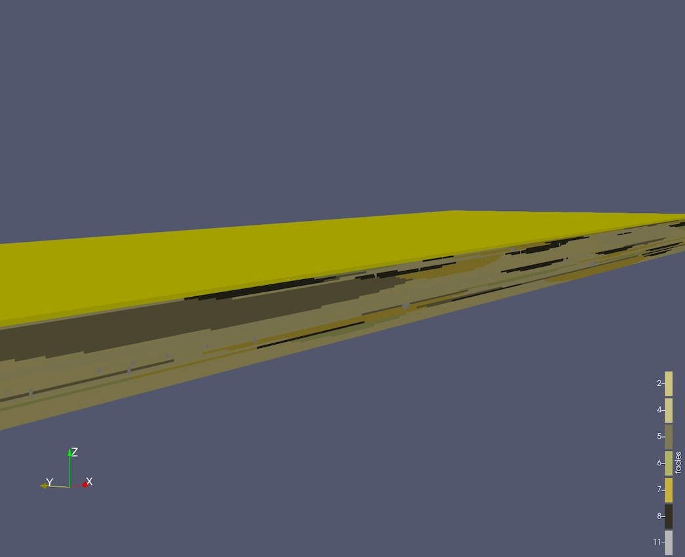

===================
HyVR Example
===================

We provide a list of examples of how HyVR can generate realistic examples of sedimentary subsurface models.
The original work by Bennet et al. (2018) included the MADE site. More details about it 
are described in their article (*Groundwater*: Bennett, J. P., Haslauer, C. P., Ross, M., & Cirpka, O. A. (2018). An open)
and in the original repository.

.. _Ammer:

	
	*Example field mimicking the Ammer site, Germany, generated using HyVR.*
	
The **script file** can be found on `github
<https://github.com/vcantarella/hyvr/blob/master/examples/ammer/ammer_v0901.py.>`_.

